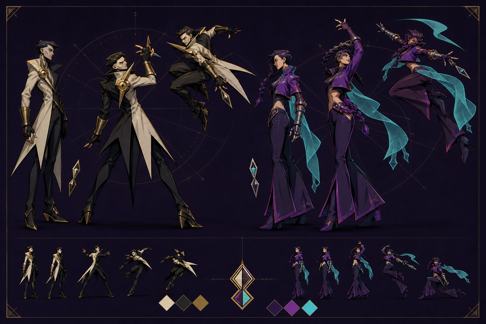

# Character and freeze-frame direction

## Decision summary

ZAWARUDO should remain a native 2D game. The recommended character pipeline is
**hybrid 2D built from 3D-authored reference and pre-rendered animation**, not
live 3D characters inside every match.

The final fighter should be a layered 2D visual composed of:

- a pre-rendered/cel-shaded sprite sequence for the body and locomotion;
- a separate procedural or `Bone2D` throwing arm that preserves exact 360° aim;
- interchangeable face, hand, coat-tail and hit-pose cels for expressive keys;
- a palette shader for exceptional freeze frames;
- the existing deterministic `Player` simulation and 32×48 collision box,
  unchanged.

This gives the game the silhouette, volume and costume design of a 3D-authored
character while preserving the clarity, Web performance and deterministic 2D
simulation it already has.



The sheet is a direction reference, not a production-ready asset. Its small
thumbnails are the relevant test: costume pieces must be simplified until the
two fighters remain distinguishable at match scale.

## What the current prototype already gets right

`Player.gd` contains more useful animation thinking than the stick-figure label
suggests. It already separates deterministic movement from cosmetic time,
freezes the animation clock during planning, samples restrained afterimages,
builds poses from named joints, changes between idle/run/airborne states, keeps
the weapon aligned with the real aim vector and shares pose information with
the planning ghost.

The limitations are presentation and scale:

- The collision body and the complete visual both occupy only 32×48 logical
  pixels in a 1280×720 frame.
- Lines and circles communicate state, but cannot carry costume, body mass,
  hands, facial acting or a unique silhouette.
- P1 and P2 are the same body and portrait with color/mirroring changes.
- The SUPER cut-in is technically strong, but the current spiked-hair portrait
  plus `MUDA MUDA` copy is too derivative to become the game's long-term
  identity.
- More detail alone will not solve the problem. The visual footprint, silhouette
  hierarchy and pose timing must change together.

## Lessons to borrow from JoJo without copying JoJo

The official animation production notes describe a useful design method: the
team catalogued the work's distinctive elements and translated them into
animation systems, including poses, motion lines, panel composition and
onomatopoeia. It also explains that the anime establishes a normal palette and
uses “special scene/cut coloring” only when emotion spikes or the story reaches
a climax. Character acting is compared to theater and the held `mie` pose of
kabuki: staging and lighting rules may be broken to maximize a decisive image.
Battles are compared to professional wrestling, where intention is presented
clearly before consequence.

Sources:

- [Official production notes: visual identity, special coloring and stage acting](https://jojo-portal.com/special/production-note/en/02/)
- [Official production notes: composition, speed and emotional direction](https://jojo-portal.com/special/production-note/en/03/)
- [Official production notes: manipulating time and rhythm frame by frame](https://jojo-portal.com/special/production-note/en/04/)

That suggests four transferable principles for ZAWARUDO:

1. **Pose is punctuation.** Do not make every frame bizarre. Reserve one strong
   pose for lock-in, SUPER, impact and victory.
2. **Color describes emotional state, not material truth.** Keep normal player
   colors stable for play, then switch the whole shot to a controlled palette
   during exceptional moments.
3. **Announce, hold, release.** The game's plan/lock/execute structure is already
   the perfect dramatic grammar. Make each boundary visible.
4. **Density follows importance.** Normal movement stays clean. Ink, hatching,
   text fragments, panel lines and camera distortion accumulate only at the
   decisive beat.

## Proposed event grammar

### Planning — the readable stage

- Stable violet/black/gold world palette.
- Normal character colors and a quiet breathing pose.
- The aiming arm tracks mechanically while the torso subtly opposes it.
- The planning ghost uses the same final silhouette but reduced to a flat,
  outlined color shape; it should not show facial/costume texture.

### Lock-in — the `mie` pose

- Over 120–180 ms, the fighter shifts into a held, asymmetric silhouette.
- A narrow spotlight or hard rim light isolates the confirming player.
- Coat tails/scarf settle one beat late.
- `READY` remains readable, but a short original word such as `LOCK` or
  `DECIDED` can strike behind the body as graphic texture.
- The opponent does not see hidden plan details; this is public readiness
  theater only.

### Execution — stepped controlled animation

- Animate bodies on twos at an apparent 12 fps while the 60 Hz simulation stays
  deterministic. This produces intentional snap instead of interpolation mush.
- Use strong contact poses and readable arcs rather than many in-between frames.
- Afterimages remain limited to fast displacement and preserve the last pose
  when time stops again.

### Impact — special-cut color

- Existing hit freeze holds the strongest contact silhouette for roughly
  50–90 ms according to accessibility settings.
- A full-screen palette preset temporarily remaps background, fighters and UI
  accent together. Do not apply a generic white flash.
- Add a diagonal crop, one hard shadow and one original impact word (`SNAP`,
  `FRACTURE`, `TIME // CUT`) selected by event type.
- Return to the base palette in two or three stepped frames.

### SUPER — three beats, not one long overlay

1. **Anticipation:** 100–140 ms; background collapses to two values and the
   fighter enters a unique pose.
2. **Portrait strike:** 350–500 ms; character-specific portrait, impossible
   palette and one original line. The current 1.45 s cut-in should be shortened
   after user testing so repeated SUPERS do not stall match rhythm.
3. **Release:** 80–120 ms; panel tears away along the knife direction and combat
   resumes on the sound transient.

The reduced-flash option should replace high-luminance inversion with hue-only
palette changes and shorter transitions, never remove the gameplay cue.

### Result — final tableau

- Freeze the actual winning world state.
- Winner adopts a character-specific victory pose; loser holds the real defeat
  silhouette.
- Apply a subdued final special palette and asymmetric spotlight.
- The result UI should frame the tableau rather than cover both bodies.

## Character design proposal

### Fighter A — The Gilded Executor

- **Primary silhouette:** inverted triangle, narrow legs, split coat tails.
- **Gesture language:** straight diagonals, open hand above eye line, chest
  rotated away from the weapon.
- **Identity anchors:** clock-hand lapel, circular chest clasp, gold bracers,
  diamond-hourglass knives.
- **Animation character:** economical and controlled; held poses end sharply.

### Fighter B — The Violet Witness

- **Primary silhouette:** tall S-curve, flared lower leg, long cyan scarf ribbon.
- **Gesture language:** spirals, crossed wrists and strong counter-rotation
  between shoulders and hips.
- **Identity anchors:** braided side lock, segmented gauntlet, asymmetric cropped
  jacket, cyan scarf tip echoing the aiming line.
- **Animation character:** delayed overlap and flowing follow-through, but the
  weapon hand still snaps to exact aim.

These designs intentionally share the game's diamonds, clocks and suspended
time motifs rather than another franchise's hair, collars, emblems or catchphrases.

### Scale and readability rules

- Keep the physics box at 32×48.
- Match the original stick fighter's combat footprint in a shared gameplay
  capture. The current calibrated target is approximately **50–53 visible
  logical pixels tall** at 720p, anchored at the same feet. Judge both height
  and filled visual mass; capes and action poses may widen the silhouette, but
  the body must neither dominate nor disappear beside the legacy fighter.
- Test solid-black silhouettes at 51 px tall before painting details.
- **Every fighter must own at least two character-exclusive outer-silhouette
  anchors.** These must identify the fighter without color, facial detail,
  weapon, nameplate or HUD portrait. The Gilded Executor's anchors are the
  angular/spiky hair wedge and the long blade-like split cape tails. Other
  fighters must use different anchor combinations rather than variations of
  those shapes.
- Approve a new arena fighter only after its solid-black silhouette remains
  identifiable at match scale against a noisy arena background, during bright
  combat effects and when roughly one third of the body is temporarily
  occluded. If recognition depends on costume texture or palette, redesign the
  outer contour before adding detail.
- Limit each fighter to one large costume shape, one medium identity prop and
  two small accents.
- Use a two-pixel-equivalent dark outer keyline at final 720p scale.
- Faces need only brow, eye mass, nose wedge and mouth angle during play. Save
  detailed anatomy for HUD portraits and cut-ins.

## Pipeline comparison

| Pipeline | Strengths | Risks | Verdict |
|---|---|---|---|
| Hand-drawn frame-by-frame 2D | Best silhouettes, smear frames and authored acting | Highest drawing cost; exact procedural aim requires layers | Excellent long-term finish, too expensive as the first full pipeline |
| Native `Skeleton2D` cutout | Fast iteration, palette swaps, direct Godot control, efficient | Can look like a paper puppet; deformed polygons need careful topology | Good for a vertical slice and modular overlays |
| Live 3D rendered through `SubViewport` | Reusable rig, arbitrary pose/camera/light, easy recoloring | Extra render target, 3D lighting/aliasing mismatch, more Web/mobile risk, harder pixel-perfect staging | Use only for isolated cut-ins or tooling experiments |
| Pre-rendered 3D to 2D sprites | Consistent volume and animation reuse; inexpensive runtime; artist can retouch key frames | More atlas memory; rerender needed after model changes | Strong base pipeline |
| **Hybrid pre-render + layered 2D** | 3D consistency, 2D clarity, exact aim, easy special-color shaders and hand-drawn accents | Requires a disciplined export convention | **Recommended** |

Godot supports both sides of this recommendation. Its cutout workflow can mix
skeletal parts with traditional `AnimatedSprite2D` cels for hands, feet and
faces, and `AnimationTree` works in 2D as well as 3D. Godot 4.7 imports animated
3D scenes, but its own performance guide warns that Web/mobile costs are highly
hardware-dependent and that viewport textures/post-processing require careful
testing.

Technical references:

- [Godot cutout animation: hybrid cels, skeletons, particles and AnimationTree](https://docs.godotengine.org/en/stable/tutorials/animation/cutout_animation.html)
- [Godot AnimationTree and 2D/3D state machines](https://docs.godotengine.org/en/stable/tutorials/animation/animation_tree.html)
- [Godot 4.7 animated 3D scene import](https://docs.godotengine.org/en/4.7/tutorials/assets_pipeline/importing_3d_scenes/index.html)
- [Godot SubViewport and 3D-in-2D render targets](https://docs.godotengine.org/en/stable/classes/class_subviewport.html)
- [Godot GPU guidance for Web/mobile and viewport textures](https://docs.godotengine.org/en/stable/tutorials/performance/gpu_optimization.html)

## Recommended production architecture

```text
Player (existing deterministic simulation and collision)
└── FighterVisual (new cosmetic child)
    ├── BodySprite / AnimatedSprite2D
    ├── AimRig / Bone2D or procedural forearm sprites
    ├── FaceCel / Sprite2D
    ├── CostumeSecondary / coat tails or scarf
    ├── PaletteMaterial / canvas_item shader
    ├── AnimationPlayer
    └── AnimationTree
```

Add a `FighterSkin` resource containing sprite frames, portrait, palette presets,
weapon attachment points, visual bounds and animation timings. `Player.gd`
continues to own physics, plan and aim. `FighterVisual.gd` reads those values and
never writes simulation state.

Suggested animation states:

| State | Minimum authored content |
|---|---|
| Idle / plan | 6–8 frame stepped loop plus one lock-in pose |
| Move | 8-frame run with clear contacts and passing pose |
| Jump | anticipation, rise, apex, fall and landing keys |
| Aim / draw | layered arm, 4 charge stages, exact direction from gameplay |
| Throw | 3–4 frame release overlay; gameplay spawn timing remains authoritative |
| Hit | one exceptional silhouette plus two recovery cels |
| Defeat | 5–7 frames and a held final pose |
| Victory | one character-specific theatrical pose |
| SUPER | one body pose, one detailed portrait and one release smear |

Use `AnimationTree` for visual state selection, but do not use root motion. The
existing simulation remains the only source of position and timing.

## Asset production workflow

1. Model and rig both characters in Blender with orthographic side cameras.
2. Use simple cel-shaded materials and a separate ink/outline render pass.
3. Animate strong key poses first; avoid physically realistic mocap timing.
4. Render body, weapon arm, face and secondary cloth to separate transparent
   image sequences at 2× or 4× target resolution.
5. Downsample and retouch the important lock/hit/SUPER frames by hand.
6. Pack atlases per fighter and import as `SpriteFrames`/textures.
7. Rebuild afterimages and ghosts from the final flat silhouette rather than
   duplicating all detailed layers.

For a Web/mobile target, pre-rendering is safer than two continuously updating
3D `SubViewport`s. A live 3D experiment is still worthwhile for the full-screen
SUPER portrait because it is short, isolated and can fall back to a static
portrait on low-quality settings.

## Implementation phases

### Phase 1 — silhouette proof

- Replace only the live stick figure with flat prototype body shapes at 64–80 px.
- Keep collision, ghosts and mechanics untouched.
- Test both fighters on all arenas at 1024×576 and touch scale.
- Acceptance: each player is identifiable with color removed and during motion.

### Phase 2 — one-fighter vertical slice

- Build Fighter A with idle, run, jump, aim, throw, hit and defeat.
- Add the layered aim rig and confirm the launch origin matches the existing
  knife simulation at every angle.
- Add one special-cut palette and lock-in pose.
- Acceptance: all gameplay/replay/online determinism tests remain unchanged.

### Phase 3 — second fighter and identity pass

- Build Fighter B with the same state contract but different gesture timing.
- Replace mirrored/tinted HUD portraits with character-specific portraits.
- Replace `MUDA MUDA` and the current SUPER line with original copy and iconography.

### Phase 4 — freeze-frame direction

- Add event-driven palette presets, panel crops, character spotlights and final
  tableaus.
- Verify reduced-flash mode and high-contrast previews in every preset.
- Profile Web and a real mobile device before enabling any live 3D cut-in.

## Acceptance criteria

- Characters are recognizable by silhouette in grayscale at normal wide-camera
  scale.
- Visual bodies never alter collision, prediction, replay hashes or online
  lockstep.
- Exact aim and knife origin remain mechanically honest.
- Normal play uses a stable palette; special colors are event-driven and brief.
- Every freeze frame has a single focal point and remains readable with UI.
- Reduced-flash mode preserves information without bright full-screen flashes.
- Web remains smooth on the project's Compatibility renderer.
- No character, costume, phrase, pose or emblem depends on recognizable JoJo IP.
