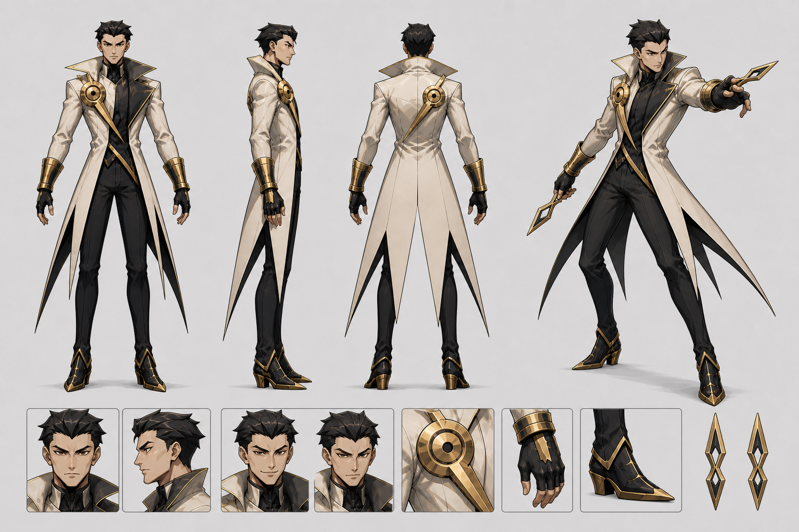

# The Duelist — canonical character specification

Status: **visual canon v1**  
Selectable class name: **THE DUELIST**  
Visual archetype / production codename: **THE GILDED EXECUTOR**  
Pronouns: **he / him**



This document and the master sheet are the source of truth for all future
portraits, sprites, animation, marketing art and AI-generated references. If an
older asset disagrees with them, follow this package.

## One-sentence identity

The Duelist is a lean, aristocratic knife fighter dressed like an ivory-and-gold
magistrate of time: surgical, controlled and quietly certain that the fight was
decided before either player moved.

He is **not** a berserker, rogue, assassin, vampire, soldier or stage magician.
His appeal comes from precision and composure rather than menace or excess.

## Design pillars

1. **Verdict, not violence.** Every throw reads like a sentence being passed.
2. **Clockwork precision.** Circles, clock hands and exact diagonals organize
   the design; generic gears and steampunk clutter do not.
3. **Ivory blade silhouette.** The high collar and two long split coat tails
   identify him before face, color, weapon or UI can be read.
4. **Restrained arrogance.** He may smirk because he predicted the outcome. He
   never howls, cackles, thrashes or performs uncontrolled rage.

## Physical design

- Masculine adult, visually late twenties to early thirties.
- Tall, approximately 7.75–8 heads, with long legs and a lean athletic build.
- Broad, angular shoulders; narrow waist; strong forearms; no bodybuilder mass.
- Warm medium/olive skin. Do not render him pale, gray or undead.
- Long, sharp face with a squared tapered jaw, straight nose, pronounced dark
  eyebrows and narrow amber-brown eyes.
- Clean shaven. No scars, tattoos, facial jewelry or makeup.
- Default expression is cool focus. Secondary expression is a small, closed or
  barely open asymmetric smirk. Teeth should not dominate the face.

### Hair — strict identity rule

Near-black, short and swept back from a shallow widow's peak. Build it from
five to seven broad angular locks, kept close to the skull. The sideburns are
short and clean.

The hair must **never** become a giant radial crown, starburst, pompadour or a
mass of long anime spikes. The old intense portrait is superseded specifically
on this point.

## Costume construction

### Primary layer — ivory judgment coat

- Warm ivory tailored coat with a narrow waist and hard, clean panel breaks.
- Very high open collar; its tips extend laterally to form a sharp shoulder
  wedge. The collar interior is near-black.
- The rear skirt divides into **exactly two dominant blade-like tails**. They
  reach to the lower calf and end in long hard points.
- Front skirt openings may form smaller ivory points, but must not create a
  many-tentacled or shredded silhouette.
- Antique-gold piping is thin and structural. No embroidery, brocade, symbols,
  medals, epaulettes or fabric texture.

### Secondary layer — black formal core

- Fitted near-black high-neck underlayer, waistcoat and trousers.
- A clean uninterrupted dark column should remain visible between the ivory
  lapels.
- No shirt collar, tie, cravat, sash or exposed chest.

### Signature clock insignia

- One large circular antique-gold clasp sits high on **his right chest**.
- The clasp contains concentric rings, one dark center and restrained radial
  divisions. It reads as a clock face, not a gear.
- One long rigid gold clock-hand/lapel descends diagonally from the clasp across
  the torso toward his left hip.
- Never mirror the clasp unless the entire character image is explicitly being
  mirrored for gameplay.

### Arms, hands and footwear

- Matching segmented antique-gold bracers cover both lower forearms.
- Black fingerless gloves. Bare fingertips remain visible.
- Near-black pointed ankle boots with a low angular heel and sparse gold edge
  construction.
- No shoulder armor, chest armor, cape, scarf, hat or jewelry.

## Weapons

Signature weapon: paired **hourglass daggers**.

- Compact throwing knives, not swords or conventional kitchen blades.
- Symmetrical end-to-end elongated diamond/hourglass silhouette.
- Antique-gold outer edge with a near-black inner body.
- Small hollow diamond at the center; sharp point at both ends.
- The pair is identical. A normal release visually presents a two-knife fan.
- Grip is delicate and exact: thumb and first two fingers, with a straight or
  deliberately broken wrist. Never use an ice-pick murderer grip.

The SUPER may multiply the same dagger design into ordered volleys. Do not
invent a second weapon family for him.

## Palette

| Role | Canon color | Use |
|---|---:|---|
| Near-black | `#111117` | underlayer, trousers, gloves, boots, collar interior |
| Warm ivory | `#E7DDC5` | coat mass and primary read |
| Antique gold | `#C79B3B` | clasp, clock hand, bracers, piping, dagger edge |
| Warm skin | `#B9825E` | face, fingertips |
| Pale clock glow | `#F3E5A7` | exceptional VFX only; never a costume fill |

Gold is aged and warm, not neon yellow. Ivory is warm, not pure white. Normal
costume art contains no purple, cyan, red or blue accent. Player-team colors may
appear in the outline, base marker and VFX, but should not recolor the canonical
coat or insignia.

## Silhouette and arena-scale rules

- Primary mass: inverted triangle from high collar to narrow waist.
- Exclusive outer-silhouette anchors: the compact angular hair wedge and two
  long blade-like coat tails.
- At 720p wide-camera gameplay scale, the visible fighter is approximately
  **50–53 logical pixels tall**, anchored to the existing 32×48 collision body.
- Simplify to 8–12 large shapes: hair, head, collar/torso, two arms, two legs,
  two coat tails and the chest disk.
- Preserve a two-pixel-equivalent dark outer keyline.
- At tiny scale, prioritize collar, ivory torso, clock disk, gold forearms,
  black legs and coat tails. Omit fingers, seams, folds and facial anatomy.
- The planning ghost uses the same outer silhouette as the live sprite.

Recognition test: in solid black, with the weapons and face removed and one
third of the body occluded, the high collar plus paired blade tails must still
identify The Duelist.

## Movement and pose language

His movement is economical. The torso stays composed while a limb creates one
precise diagonal. Poses should resemble measured calligraphy rather than dance
or brawling.

- **Idle / planning:** upright, weight slightly back, chin level, throwing hand
  quiet near the clock clasp. Minimal breathing.
- **Aim / charge:** chest rotates away from the target; weapon hand rises into
  exact alignment; free hand opens above or across the eye line like a judge
  framing evidence.
- **Lock-in:** asymmetric held silhouette, long straight arm, coat tails settling
  one beat after the torso. This is his theatrical punctuation pose.
- **Run:** long low stride with the torso aimed forward and very little vertical
  bounce. Coat tails form two parallel blades behind him.
- **Jump:** compact takeoff, then a clean spear-like diagonal. No acrobatic
  somersault unless a mechanic explicitly requires one.
- **Throw:** tiny preparation, crisp wrist release, immediate recovery. The
  mechanical spawn direction always wins over decorative animation.
- **Hit:** composure breaks for one sharp angular key, then closes again.
- **Defeat:** one knee down, clock clasp turned away, hands still controlled.
- **Victory:** adjusts one glove or lowers an open hand after the last dagger;
  no roaring or celebratory jumping.

Animate the body on stepped twos (approximately 12 fps) over the deterministic
60 Hz simulation. Secondary coat motion may settle one pose late, but must not
obscure aim, feet or collision readability.

## Personality and presentation

The Duelist speaks briefly and precisely. He notices timing, errors, angles and
inevitability. His confidence is formal rather than flamboyant. He does not
insult an opponent's identity; he comments on the decision they made.

Voice direction: low-to-mid register, dry, unhurried, articulate, with anger
expressed by becoming quieter. Avoid theatrical villain laughter, breathy
seduction or aristocratic parody.

Sample tone (directional, not mandatory final copy):

- Lock-in: “Decision recorded.”
- Advantage: “You spent that instant poorly.”
- Victory: “The result was punctual.”

## Gameplay-to-visual translation

The class controls space with a charge-dependent two-dagger fan. Low charge is
wide and forgiving; high charge is narrow, fast and capable of hard-surface
ricochets. Visuals must make this distinction honest.

- Low charge: the two daggers separate visibly; wrist and open hand describe a
  shallow fan.
- High charge: both daggers align close to one judgment line; the clock clasp
  gives one restrained pale-gold pulse.
- Ricochet: a thin straight gold tick and a brief clock-index spark, not a large
  magical explosion.
- SUPER: ordered waves of the same hourglass daggers. Graphic clock divisions
  accumulate behind him, hold, then release in sequence.
- Core VFX geometry: circles, clock ticks, long diagonals and diamonds.
- Avoid gears, lightning, fire, smoke magic, blood motifs and free-floating
  Roman numerals.

## Portrait and camera rules

- HUD portrait: head and upper collar, three-quarter view, eyes aimed toward
  the opponent, neutral focus or slight smirk.
- SUPER cut-in: chest-up, one open hand crossing the composition, clasp visible,
  severe diagonal crop and two-value shadow. Intensity comes from staging, not
  distorted anatomy or enormous hair.
- Always leave enough frame to read the high collar and at least part of the
  clock clasp. A face-only crop loses the class identity.
- Keep normal eye whites and human pupils. No glowing eyes in base art.

## Audio texture

- Cloth: short, dry tailored-coat snaps.
- Bracers and clasp: muted antique-metal ticks, never heavy armor clanks.
- Daggers: narrow high-frequency cuts with a glassy clock-tick transient.
- Lock-in: one close mechanical click.
- SUPER: a measured sequence of ticks followed by sudden silence and the volley.

## Hard anti-drift rules

Reject an image or animation if any of the following is true:

- hair forms a giant spiked crown or recognizable imitation of an existing
  anime/manga character;
- the coat is pure white, military, armored, caped, frilled or covered in trim;
- the rear silhouette has more or fewer than two dominant coat tails;
- the circular clasp is missing, duplicated, gear-shaped or placed on his left;
- a tie, sword, firearm, cane, hat or scarf is added;
- gold becomes neon yellow or saturated accent colors enter the costume;
- his body becomes bulky, elderly, teenage, undead or androgynously delicate;
- his expression becomes manic, feral or broadly comedic;
- the daggers become ordinary knives, full-size swords or mismatched props;
- the pose hides the collar, chest clock and both feet without a deliberate
  close-up reason.

## Reusable AI prompt — full character

```text
One original male video-game fighter, THE DUELIST, visual archetype “Gilded
Executor”: tall lean athletic adult, warm medium olive skin, long sharp face,
strong straight nose, heavy dark brows, narrow amber-brown eyes, clean shaven;
short near-black hair swept back from a shallow widow's peak in 5–7 broad
angular locks, kept close to the skull. Warm ivory fitted judgment coat with a
very high angular open collar and exactly two long stiff blade-like rear tails;
near-black high-neck waistcoat and trousers; thin antique-gold structural
piping; one large circular clock clasp high on his right chest with a rigid long
gold clock hand descending diagonally toward his left hip; matching segmented
gold forearm bracers, black fingerless gloves, pointed black ankle boots with
sparse gold edges. He holds two identical compact double-ended hourglass
throwing daggers with hollow diamond centers. Controlled, surgical,
aristocratic, quietly arrogant; precise straight diagonals and economical pose.
Crisp high-end 2D game concept art, clean dark contour, hard cel shading,
original design. Palette only near-black #111117, warm ivory #E7DDC5, antique
gold #C79B3B and warm skin #B9825E. No text or watermark.

AVOID: giant radial or starburst anime hair, resemblance to existing characters,
wild grin, rage, vampire styling, military uniform, armor, cape, scarf, tie,
hat, medals, gears, sword, gun, saturated costume colors, extra coat tails,
ordinary knives, photorealism, 3D rendering, chibi anatomy.
```

For any new generation, append only the requested pose, framing, expression and
background. Do not rewrite the identity block from memory.

## Per-asset requirements

| Asset | Must show | May simplify |
|---|---|---|
| Arena sprite | hair wedge, collar, ivory torso, clock disk, gold forearms, two tails | face, fingers, piping, coat panels |
| Planning ghost | exact live outer contour and aim | all interior detail and material color |
| HUD portrait | same face, compact hair, collar, clasp edge | lower body and weapons |
| SUPER cut-in | face, open-hand diagonal, collar, full clasp | lower body; one dagger may be off-frame |
| Character select | full silhouette, two daggers, neutral and lock poses | tiny construction seams |
| Marketing key art | all canonical construction and palette | nothing identity-bearing |

## Approval checklist

Before accepting a Duelist asset, answer yes to all of these:

1. Is the selectable name **The Duelist** and the same man shown throughout?
2. Is his short hair angular but compact?
3. Are the high collar and exactly two blade-like rear tails readable?
4. Is the clock clasp on his right chest with one descending clock hand?
5. Are ivory, near-black and antique gold the only costume color families?
6. Is he lean, adult and controlled rather than bulky or manic?
7. Are the weapons matching double-ended hourglass daggers?
8. Does the pose communicate precision through one strong diagonal?
9. Is the relevant gameplay aim still visually honest?
10. Does the image remain original and free of recognizable third-party design
    language?

## Canonical and supporting files

- Master sheet: `docs/concepts/duelist-master-sheet-v2.png`
- Runtime portrait: `assets/art/portraits/duelist-portrait-v1.png`
- Earlier costume construction sheet: `docs/concepts/gilded-executor-model-sheet-v1.png`
- Broad visual direction (male design only): `docs/concepts/duelist-visual-direction-v1.png`
- Tiny arena proof: `previews/gilded-executor-simplified-arena-proof-v1.png`
- Simplified sprite source notes: `art_source/sprites/gilded-executor-proof-v1/README.md`

Superseded for identity: `assets/art/portraits/duelist-portrait-intense-v2.png`.
It is retained only as historical exploration; its giant radial hair and manic
expression must not guide future art or return to runtime wiring.
