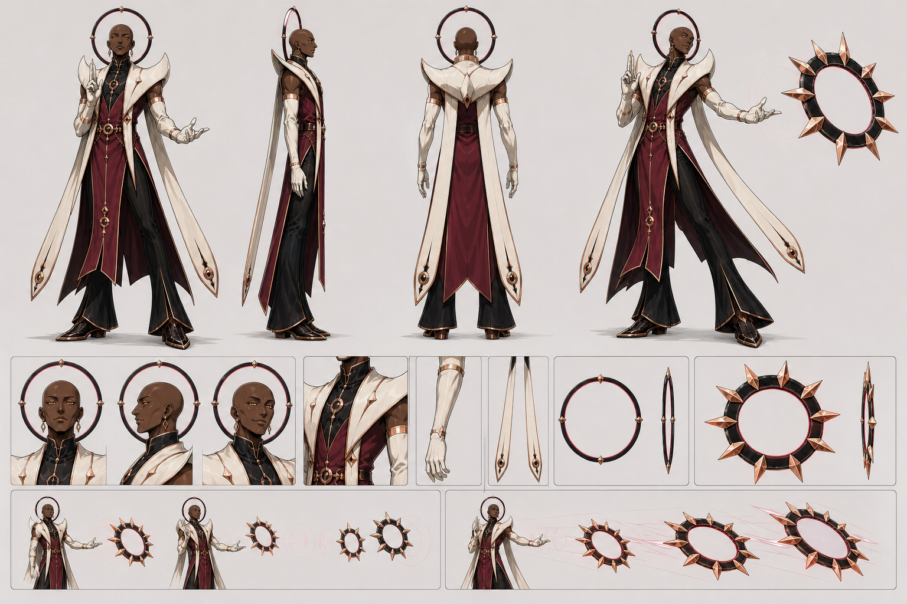

# The Eclipse — canonical character specification

Status: **visual canon v1**  
Selectable class name: **THE ECLIPSE**  
Visual archetype / production codename: **THE FALSE SAINT**  
Pronouns: **he / him**



This document and the master sheet are the source of truth for all future
portraits, sprites, animation, marketing art and AI-generated references. If an
older Broodtail or chakram concept disagrees with them, follow this package.

## One-sentence identity

The Eclipse is an impeccably mannered false saint who continuously manufactures
bladed counterfeit halos, consecrates parts of the arena with them and calmly
allows each independent decree to return to its maker.

He is **not** a monk, wizard, tribal hunter, circus performer, animal summoner,
wind priest or conventional religious leader. His appeal comes from the
contradiction between apparent compassion and effortless ruthlessness.

## Design pillars

1. **Kind face, merciless act.** His expression offers absolution while his
   weapon occupies the opponent's future escape route.
2. **Counterfeit divinity.** The permanent crown is a generator; the dangerous
   halos are infinitely reproduced claims of holiness.
3. **Ceremony instead of exertion.** He places and recalls weapons with liturgical
   gestures rather than athletic throws.
4. **Orbit as territory.** Every deployed corona changes the composition of the
   arena and remains visually connected to him through shared circular grammar.

## Physical design

- Masculine adult, visually early forties.
- Very tall, approximately 8 heads, with long elegant limbs and a lean athletic
  build.
- Broad sloped shoulders, narrow waist and strong elongated hands. He is neither
  frail nor heavily muscular.
- Deep brown skin with warm undertones.
- Severe handsome face: high cheekbones, long straight nose, narrow jaw, thin
  arched eyebrows and half-lidded pale amber eyes.
- Head completely shaved. No hair, facial hair, scars, tattoos or makeup.
- Default expression is tranquil concern. Secondary expression is a small,
  sympathetic smile that never reaches the eyes.
- Age and authority must remain visible. Do not turn him into a youthful,
  delicate romantic lead.

## Costume construction

The costume is fictional clerical runway fashion. It must suggest sacred office
without reproducing a real religion's garments or symbols.

### Wine-red central column

- Long fitted sleeveless tunic/cassock in deep wine red.
- High near-black throat panel closes the neck completely.
- Front divides into two hard tailored points around the knees.
- Back skirt is split for high jumps and wide leg poses.
- Sparse rose-gold orbital seams and one circular waist clasp organize the
  garment. No written scripture, crosses, medals or embroidery.

### Pearl shoulder mantle

- Huge sculptural pearl-white mantle forms two downward crescent shapes around
  the neck and shoulders.
- It is stiff tailored fabric, not armor, feathers, fur or bone.
- The crescents frame his shaved head inside the aureole and create the medium
  silhouette anchor beneath the circle.
- Mantle points never rise into horns or become separate pauldrons.

### Gloves, trousers and footwear

- Pearl-white fitted gloves extend above both elbows.
- Thin rose-gold bands mark the upper glove edge and wrist.
- Near-black fitted trousers flare dramatically below the knee into wide clean
  hems.
- Pointed wine-black shoes use very sparse rose-gold construction lines.
- Hands remain long and readable; fingers are central to his gesture language.

### Ceremonial stole

- One narrow pearl-white stole loops behind the shoulders.
- It falls as **exactly two** long straight blade-like ribbons, one on each side,
  ending near the calves.
- Each ribbon has one small circular rose-gold terminal ornament.
- The two ribbons may trail during jumps and recalls but never multiply, braid,
  curl like tentacles or wrap around the arms.

### Jewelry

- Exactly two long circular/diamond rose-gold earrings, one per ear.
- One restrained circular waist clasp and sparse small orbital fittings.
- No crown, rosary, prayer beads, rings on every finger or recognizable sacred
  jewelry.

## Permanent aureole — never thrown

The aureole is part of The Eclipse's permanent silhouette and the generator for
his weapons. It is not a projectile.

- Exactly one thin, smooth, unbladed near-black ring.
- Centered vertically behind his shaved head.
- Outer diameter only slightly wider than his shoulders.
- One hairline wine-red inner glow.
- Exactly four tiny rose-gold clasps at the cardinal points.
- It follows his body cosmetically and remains present during idle, casting,
  jumps, hits, defeat, SUPER and while any number of coronas are deployed.

The Eclipse is **never halo-less**. Never remove, throw, enlarge, blade or stack
the permanent aureole.

## Generated corona — persistent chakram

Each attack generates a new dangerous corona from the aureole without consuming
or replacing it.

- Thick near-black ring with a smooth open center.
- Approximately 1.35 times his shoulder width.
- Exactly **twelve** broad, evenly spaced rose-gold solar blades on the outer
  edge.
- One thin wine-red inner glow.
- Clearly larger, heavier and thicker than the permanent aureole.
- Every generated corona is identical. Several may coexist in the arena because
  they launch on different turns and resolve independently.

Generation sequence:

1. A faint outer ring expands from the permanent aureole.
2. Twelve broad blades open in a clockwise sequence.
3. The completed corona separates and aligns with his extended palm.
4. The permanent smooth aureole remains visibly centered behind his head.
5. The new corona travels along the committed aim without being physically
   touched.

On return, a corona passes around his body plane, contracts into a thin ripple
and dissolves into the permanent aureole. It does not remain stacked behind him.

## Palette

| Role | Canon color | Use |
|---|---:|---|
| Deep wine | `#551D35` | tunic, split skirt, controlled VFX field |
| Near-black | `#111016` | throat, trousers, shoes, aureole and corona bodies |
| Pearl white | `#E8E1D4` | mantle, gloves, stole ribbons |
| Rose gold | `#B77A62` | corona blades, clasps, seams, jewelry |
| Inner glow | `#B92F55` | thin ring light and route accents only |
| Deep brown skin | `#6E4334` | face and bare arms |
| Pale amber | `#D8B36A` | eyes only |

Wine, pearl and rose gold must remain distinct from The Duelist's warm ivory and
antique gold. The inner glow is a hairline accent, not a neon aura. Player-team
colors belong in outlines and markers rather than replacing the sacred palette.

## Silhouette and arena-scale rules

- Exclusive silhouette anchors: smooth circular aureole around the shaved head,
  pearl double-crescent mantle and two long straight stole ribbons.
- Primary form: tall narrow column with wide lower trouser hems.
- At 720p wide-camera scale, keep his visible body approximately **50–53 logical
  pixels tall**, foot-anchored to the existing 32×48 collision body. The aureole
  may extend above and beside the head without changing collision.
- A generated corona is a separate, unmistakable ring roughly one third of the
  fighter's visible height at gameplay scale.
- At tiny scale preserve: bald head inside ring, white mantle, wine torso, white
  glove blocks, two ribbon points and flared black feet.
- Deployed coronas need twelve-blade rhythm, but individual small blades may be
  grouped into four readable outer clusters at the smallest sprite scale as
  long as the high-resolution asset and collision remain twelve-fold.
- Use a two-pixel-equivalent dark keyline around body and weapon.

Recognition test: in solid black with the face and color removed, the ring,
mantle crescents and paired ribbons must identify The Eclipse even while all
weapon coronas are away from him.

## Movement and pose language

The Eclipse appears to ascend through faith rather than jump through effort. His
real movement remains mechanically honest, but the acting hides exertion behind
ceremony.

- **Idle / planning:** upright with relaxed knees, head slightly bowed, one hand
  at the sternum and the other open toward the arena.
- **Walk:** long gliding steps; torso and aureole stay level while the flared
  trousers describe the stride.
- **Aim / charge:** open palm rotates toward the aim line; the other hand raises
  two fingers. A new corona forms behind him and slides toward the open hand.
- **Release:** two fingers close together. No shoulder windup or follow-through.
- **Lock-in:** deep contrapposto, one pearl glove above the eye line, mantle and
  ribbons forming an asymmetric devotional tableau.
- **First jump:** the highest takeoff in the roster. Legs extend beneath a quiet
  vertical torso while the stole ribbons snap downward like quotation marks.
- **Second jump:** visibly weaker; one small rose-gold orbital mark appears under
  the trailing foot and the body redirects without a large anticipation.
- **Fall:** slower than baseline, with mantle level and ribbons hanging straight
  enough to sell controlled descent without literal flight.
- **Hit:** his calm expression breaks for one sharp frame; aureole tilts but does
  not detach.
- **Defeat:** kneels with palms upward while the permanent aureole dims, never
  disappears.
- **Victory:** touches two fingers to the brow, then offers the defeated opponent
  a soft blessing without looking down at them.

Animate the body on stepped twos at an apparent 12 fps over the deterministic
60 Hz simulation. The permanent aureole is a cosmetic attachment. Each deployed
corona is its own authoritative gameplay object and must never be faked as part
of the body animation.

## Personality and presentation

The Eclipse is a ruthless false saint. He speaks gently, listens patiently and
never loses social grace. His mercy is theatrical: he considers obedience the
only state in which another person deserves to continue existing.

He does not rant about evil or confess that his faith is false. He believes
results validate doctrine, so every victory becomes retroactive proof that he
was divinely correct. If a corona is destroyed, he calls it a useful test of the
opponent's remaining doubt.

Voice direction: quiet mature baritone, excellent diction, intimate volume and
no audible physical strain. Threats sound like pastoral advice. Anger removes
the smile but never raises the voice.

Sample tone (directional, not mandatory final copy):

- Lock-in: “Stand where grace may reach you.”
- Deploying another corona: “Another truth, for your consideration.”
- Corona destroyed: “Doubt is permitted. Briefly.”
- Victory: “You were heard. You were simply incorrect.”

## Gameplay-to-visual translation

The Eclipse may generate a new corona on a later turn while previous coronas
remain active. Never depict the weapon as unique inventory.

### Outbound

- Charge changes speed from a deliberate cast to a firmer decree; corona size
  and blade count stay constant.
- The committed aim is exact. Visual ornament must not bend the launch line.
- A thin wine-red circular echo remains at the cast origin for one stepped frame.

### Holding

- The first impact with a permanent hard wall or platform produces one clear
  ricochet. Breakable cover or the next terrain impact pins the corona at the
  impact point while it continues to spin.
- A midair corona stops at its exact position when its outbound window ends.
- It remains a stationary hazard through the following turn.
- Spin is calm and constant. Do not make it wobble, hunt targets or orbit The
  Eclipse during the holding state.
- Each active corona receives one faint independent orbital tick in the HUD or
  planning preview so their different return timing is readable.

### Returning

- Return begins on that corona's third turn, independently of newer casts.
- The corona accelerates directly back toward The Eclipse, ignoring ordinary
  gravity during recall.
- He opens both hands and allows it to pass into the permanent aureole; he does
  not catch the blade physically.
- The return path remains dangerous and visually distinct through inward-facing
  wine-red streaks.

### Counterplay

- One opposing projectile impact destroys a deployed corona immediately.
- Destruction breaks the rose-gold blades into twelve short nonlethal light
  facets, then collapses the black ring. The fragments must not look like new
  projectiles.
- The permanent aureole flickers once in sympathy but remains intact.

### SUPER

- The permanent aureole produces exactly three full-size twelve-bladed coronas.
- They launch in a forward spread and retain the same outbound, holding and
  independent return lifecycle as normal coronas.
- The SUPER does not grant wings, a giant beam, a transformed costume or a stack
  of permanent crowns.

Working move-language recommendations:

- Normal corona: **DECREE**
- Placement/holding state: **CONSECRATION**
- Return: **ABSOLUTION**
- Opponent destroys one: **HERESY**
- SUPER: **THREEFOLD EDICT**

These are presentation recommendations; internal `CHAKRAM` code identifiers can
remain unchanged.

## Portrait and camera rules

- HUD portrait: shaved head, pale amber eyes, smooth aureole, mantle crescents
  and one raised pearl-gloved hand.
- Character select: full narrow silhouette with one bladed corona floating away
  from his open hand while the permanent aureole remains visible.
- SUPER cut-in: severe low-angle bust, two-finger benediction in foreground,
  smooth aureole behind the head and three forming coronas framed around—not
  stacked directly behind—it.
- His smile should remain small. Wide grins, exposed teeth and manic eyes destroy
  the character.
- Do not crop every circular element concentrically; offset coronas create the
  territorial composition that defines the class.

## Audio texture

- Permanent aureole: nearly silent, with one low porcelain resonance when a new
  corona begins forming.
- Blade generation: twelve delicate metallic ticks resolving into one chord.
- Outbound corona: narrow circular cut with a restrained choral breath.
- Holding: slow intermittent glass harmonic, not a constant buzzing saw.
- Return: chord reverses and drops in pitch as the corona accelerates home.
- Destruction: dry ceramic fracture followed by abrupt silence.
- Voice always sits above the effects without shouting.
- Avoid wind storms, church bells, organ clichés, demonic whispers or generic
  laser sounds.

## Hard anti-drift rules

Reject an image or animation if any of the following is true:

- the permanent smooth aureole is absent, thrown, bladed, enlarged or multiplied;
- he becomes halo-less while any corona is active;
- a generated corona has anything other than twelve broad outer blades;
- active coronas stack behind his head instead of occupying independent arena
  positions;
- he grips, winds up or physically catches the chakram like an athlete;
- the shaved head gains hair, a hat, crown or hood;
- the pearl crescent mantle becomes armor, horns, wings or fur;
- the stole has more or fewer than two long straight ribbons;
- real-world religious symbols, scripture or identifiable clerical uniforms are
  added;
- he becomes young, frail, monstrous, demonic, comedic, loudly enraged or
  heavily muscular;
- blue-and-white pastor clothing, wind effects or other recognizable traits are
  borrowed from Goenitz;
- the palette becomes ivory-and-antique-gold like The Duelist or navy/orange like
  The Rook;
- rendering leaves the game's flamboyant high-fashion anime/manga language for
  photorealism, generic fantasy or military sci-fi.

## Reusable AI prompt — full character

```text
One original male anime fighting-game character named THE ECLIPSE, visual
archetype “The False Saint”: very tall lean mature man in his early forties,
deep brown skin, long elegant limbs, broad sloped shoulders, narrow athletic
waist, strong long hands, severe handsome face, high cheekbones, long straight
nose, thin arched brows, half-lidded pale amber eyes, completely shaved head, no
facial hair. Tranquil concerned expression with a tiny sympathetic smile.

Original fictional clerical runway costume: deep wine-red long fitted sleeveless
tunic with high near-black throat panel and split tailored skirt; huge stiff
pearl-white shoulder mantle shaped as two downward crescents; pearl-white gloves
above both elbows; near-black fitted trousers with dramatic flared hems; pointed
wine-black shoes with sparse rose-gold edges; exactly two long straight
pearl-white stole ribbons ending near the calves; sparse rose-gold orbital seams,
waist clasp and circular earrings. No real religious symbols.

Exactly one permanent smooth aureole is always centered behind his shaved head:
thin unbladed near-black ring only slightly wider than his shoulders, hairline
wine-red inner glow, exactly four tiny rose-gold cardinal clasps. This permanent
aureole never leaves and is never bladed. Any weapon shown is a separate larger
generated corona: thick near-black open ring about 1.35 times shoulder width,
exactly twelve broad evenly spaced rose-gold solar blades on the outer edge and
one thin wine-red inner glow. Multiple separate coronas may float away from him
while the smooth aureole remains attached.

Calm two-finger benediction and open-palm casting pose, effortless, liturgical,
vain, perfectly mannered and ruthless. Crisp original flamboyant high-fashion
anime/manga game art, clean near-black contour, hard cel shading, bold graphic
shadows, exaggerated held pose. Palette: deep wine #551D35, near-black #111016,
pearl #E8E1D4, rose gold #B77A62, thin glow #B92F55, deep brown skin #6E4334,
pale amber eyes #D8B36A. No text or watermark.

AVOID: resemblance to existing characters, blue-and-white pastor costume, wind
powers, Goenitz traits, real religious symbols, missing/throwing/blading the
permanent aureole, stacked crowns, wrong corona blade count, gripping the
weapon, generic monk, pope hat, wings, demon traits, hair, staff, sword, gun,
photorealism, 3D rendering.
```

For new generations, append only the requested pose, framing, expression,
number/location of separate weapon coronas and background. Do not rewrite the
identity block from memory.

## Per-asset requirements

| Asset | Must show | May simplify |
|---|---|---|
| Arena sprite | bald head in smooth aureole, white mantle, wine column, two ribbons, open hand | jewelry, seams, facial anatomy |
| Corona projectile | open black ring, rose-gold twelve-fold blade rhythm, wine inner line, clear state trail | individual blade bevels |
| Planning ghost | exact body silhouette plus all independently projected corona paths | costume color and texture |
| HUD portrait | same mature face, smooth aureole, mantle crescents, pearl glove | lower body and deployed coronas |
| SUPER cut-in | smooth crown retained, three separate forming coronas, benediction hand | legs and ribbon terminals |
| Character select | full body, permanent aureole and at least one separate corona | small jewelry and waist fittings |
| Marketing key art | every identity anchor, ring distinction and costume construction | nothing identity-bearing |

## Approval checklist

Before accepting an Eclipse asset, answer yes to all of these:

1. Is the selectable class named **The Eclipse**?
2. Is he a tall, lean, mature, deep-brown-skinned man with a shaved head?
3. Is his expression gentle, controlled and quietly ruthless?
4. Does exactly one thin smooth four-clasp aureole remain behind his head?
5. Are all dangerous coronas separate, larger and exactly twelve-bladed?
6. Can several coronas coexist without stacking or removing his permanent crown?
7. Are the pearl crescent mantle and exactly two straight stole ribbons present?
8. Does he cast with open liturgical gestures rather than physical exertion?
9. Do outbound, holding, destruction and independent return states remain
   mechanically honest?
10. Is the result original flamboyant anime/manga game art without recognizable
    Goenitz costume, wind-power or real-religion copying?

## Canonical and supporting files

- Master sheet: `docs/concepts/chakram-rework/eclipse-master-sheet-v1.png`
- Runtime portrait: `assets/art/portraits/eclipse-portrait-v1.png`
- Approved personality/costume mockup: `docs/concepts/chakram-rework/eclipse-false-saint-mockup-v1.png`
- Mechanics implementation: `scripts/Chakram.gd`
- Roster mechanics summary: `README.md`

The first mockup's halo-less side vignette is superseded and must not guide
future weapon-state art. The main costume and personality remain supporting
reference. The old `broodtail-portrait-v1.png`, giant-squirrel silhouette and
glider-companion fiction are superseded for visual identity and remain as
historical prototype material only.
