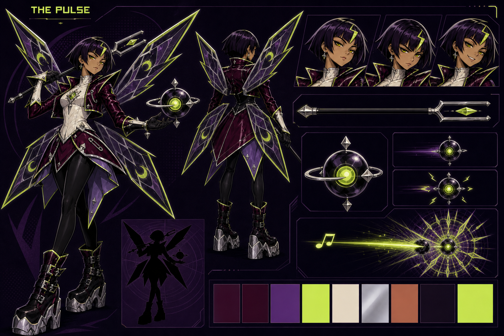

# The Pulse — canonical character specification

Status: **visual canon v1**

Selectable class name: **THE PULSE**

Visual archetype / production codename: **THE RESONANCE PUNK**

Pronouns: **she / her**



This document and the master sheet are the source of truth for all future
portraits, sprites, animation, marketing art and AI-generated references. If an
older Shock, Static Witch or first-pass pixie concept disagrees with them,
follow this package.

## One-sentence identity

The Pulse is a petite acid-moth magical girl who seeds the arena with suspended
beats and then drives a razor-straight note through them, turning cute,
meticulous spellcraft into a violently amplified punk refrain.

She is **not** a whimsical fairy princess, manic criminal, firearm user,
electricity mascot, gothic doll or bubbly idol. Her appeal comes from the
contradiction between an adorable face, contemptuous composure and geometrically
brutal magic.

## Design pillars

1. **Cute face, cutting attitude.** She is attractive and compact without being
   innocent, childish or sexually infantilized.
2. **Magical girl after the encore.** Transformation-jewel and petal-skirt
   grammar survive beneath vinyl, hardware, platforms and deliberate punk
   severity.
3. **Hard moth, not soft butterfly.** Four stained-glass wing blades make her
   silhouette beautiful, artificial and dangerous.
4. **Set the beat, hit the beat.** The orb is a visible promise; the straight
   plasma note is the payoff. Every effect must explain that relationship.
5. **Defiance under control.** Her punk identity comes from tailoring, stance
   and refusal to please—not graffiti, weapon clutter or random destruction.

## Physical design

- Adult woman, visually mid-twenties.
- Petite, approximately 7 heads tall, with a compact athletic build.
- Narrow shoulders and waist, defined back and core, sturdy thighs and calves.
  She is quick and physically credible, not frail, waifish or child-proportioned.
- Warm tan skin with clean graphic shadow planes.
- Cute heart-shaped face with high cheekbones, small straight nose, pointed chin
  and one tiny beauty mark below the left eye.
- Large almond-shaped acid-gold eyes beneath sharp dark brows.
- Default expression is half-lidded superiority with a closed-mouth half-smile.
- Combat focus opens the eyes and sets the jaw. Enjoyment appears as a small
  sharp grin, never a wild laugh, bulging stare or open-mouthed mania.

### Hair — strict identity rule

- Short black-violet bob ending at the jaw.
- Heavy blunt fringe broken into crisp geometric points.
- Choppy blade-like ends kick outward around the cheek and nape.
- Exactly one acid-chartreuse lightning-shaped forelock sits at her **right
  temple** and angles inward over the fringe.
- A tiny bone-white highlight may appear at the crown under strong light.

Never add long hair, blue hair, braids, pigtails, twintails, antennae, a shaved
side, a mohawk, ribbons or a large hair ornament. The bob and single lightning
forelock must read at portrait and sprite scale.

## Costume construction

### Faceted magical bodice

- Bone-white fitted high-neck bodice covers the torso from throat to hips.
- Faceted diamond seams give the fabric a cut-crystal construction.
- The center point extends over the pelvis beneath the overskirt.
- One diamond transformation brooch sits at the sternum: chrome outer housing,
  translucent acid-green center and a fine internal crack shaped like a tuning
  waveform.
- No cleavage, exposed midriff, corset lacing, bow, sailor collar or frills.

### Patent bolero

- Cropped black-cherry patent-vinyl bolero ends above the natural waist while
  the bone bodice remains visible beneath it.
- Extremely pointed raised shoulders create two upward diagonal hooks.
- Sharp split lapels frame the high white neck.
- Acid-chartreuse piping traces the outer shoulder and lower hem.
- Chrome details are sparse and intentional: one short zipper, one safety-pin
  clasp and a few diamond studs at most.
- Sleeves are fitted to the wrist and wrinkle in hard reflective planes.

The bolero is couture, not a biker jacket covered in patches. Do not add logos,
text, graffiti, dozens of pins, chains or torn fabric.

### Petal overskirt and leggings

- A controlled asymmetric overskirt begins at the high hip.
- Outer petals are black cherry with bone-white piping; inner facets are deep
  ultraviolet.
- Panels end in long hard points and echo the four wings without becoming extra
  wings themselves.
- Fully opaque near-black fitted leggings/shorts cover both legs continuously.
- No exposed underwear, garters, fishnets, bare thigh windows or dangling belts.

### Gloves, cuffs and jewelry

- Black fitted gloves end in slightly pointed fingertips.
- Bone-white structured cuffs flare into one angular point over each forearm.
- Small chrome diamond earrings are the only mandatory jewelry.
- Nails may carry acid-green tips in close-up art.

### Platform combat boots

- Huge black and black-cherry platform boots rise to mid-calf.
- Three substantial chrome buckle straps cross each boot.
- Faceted chrome soles are deep, heavy and architectural, with a stable broad
  footprint rather than a conventional heel.
- Acid-chartreuse piping appears only along the upper edge and one sole seam.
- Boots must look capable of landing from a jump and anchoring recoil.

The boots are a primary silhouette anchor. Never replace them with pumps,
slippers, roller skates, sneakers or delicate magical-girl heels.

## Four hard-moth wings

The wings provide her class-exclusive silhouette and must obey the count.

- **Exactly four** separate panels: two long upper wings and two shorter lower
  wings.
- Upper roots attach near the shoulder blades; lower roots attach beside the
  lower spine. Each root remains visually distinct in back views.
- Upper wings are long tapered diamonds with one serrated outward break.
- Lower wings are shorter, wider blade-petals angled down and outward.
- Material resembles smoked ultraviolet acrylic or stained glass held in a
  chrome vein framework.
- Acid-chartreuse razor piping traces the perimeter.
- Each panel contains exactly one abstract acid crescent eye-spot.
- Transparency is controlled; the dark panel mass must remain readable against
  bright arenas.
- In neutral poses the four wings form a serrated X. During aim they cant into a
  narrower diamond. During detonation they snap wide for one graphic accent.

The wings do not flap like an insect, shed glitter or carry her in continuous
flight. Movement can use brief rigid rotations at the roots to support her
existing jump arc. Never add a fifth or sixth wing, feather texture, rounded
butterfly lobes, a cape, tail, antennae or insect abdomen.

## Tuning-fork baton

The baton is the sole handheld weapon and the visible source of her straight
plasma note.

- Exactly one baton, approximately 75 cm long—roughly shoulder to mid-thigh on
  her body.
- Straight near-black shaft with narrow chrome bevels.
- Faceted chrome diamond butt cap.
- Large open two-pronged tuning fork at the head.
- One acid-green diamond crystal floats between the prongs without touching
  them.
- The opening between the prongs is always visible in silhouette.
- The crystal brightens with charge and compresses into a horizontal line at
  release.

She conducts, points and strikes poses with it like an arrogant bandleader. It
is never shouldered or sighted like a firearm. Do not add a trigger, barrel,
muzzle, magazine, guitar body, microphone head, sword edge, spear tip or second
weapon.

## Persistent beat orb

Each cast creates another identical arena object; an orb is not unique inventory
and several may coexist.

- Glossy black-violet pearl approximately the size of her head.
- One acid-green circular core is visible on each of two opposite faces.
- Exactly one thin chrome orbit ring crosses the equator.
- Exactly four small chrome diamond tabs occupy the cardinal points.
- Surface is pristine hard lacquer, not metal scrap, glass bubble or organic
  tissue.

State language:

1. **Travelling / inert:** dim core, steady equatorial ring, no sparks.
2. **Arming:** four tiny acid ticks appear sequentially at the cardinal tabs.
3. **Armed:** bright compressed core and one slow ultraviolet pulse through the
   lacquer.
4. **Resting:** bottom tab aligns cleanly with the platform; it never sprouts
   legs, roots or a stand.
5. **Small pop:** compact four-point violet pressure diamond with a thin acid
   rim.
6. **Plasma combo:** enormous razor-edged radial resonance glyph, alternating
   ultraviolet and acid frequency spokes.

Orbs are spell objects, not bombs, mines, eyeballs, drones, speakers, pets or
familiars.

## Palette

| Role | Canon color | Use |
|---|---:|---|
| Deep plum | `#211426` | backdrop fields, deepest wing glass and VFX shadows |
| Black cherry | `#3A102A` | patent bolero, outer skirt panels and boot uppers |
| Ultraviolet | `#6D3E99` | inner skirt facets, wing glass and resonance fields |
| Acid chartreuse | `#C6F25B` | hair lock, piping, spell cores and narrow VFX accents |
| Bone white | `#EAE2D5` | bodice and forearm cuffs |
| Chrome | `#BFC7CF` | wing veins, baton, buckles, orb ring and hardware |
| Warm tan skin | `#B97861` | face and skin |
| Black violet | `#24162F` | hair, gloves and leggings |
| Acid gold | `#D7EF55` | irises only |

Acid chartreuse is a precise visual sting, never a full-body neon wash. Keep
black cherry warmer and darker than the purple wing glass. Team color belongs
in outlines and markers rather than replacing her personal palette.

## Silhouette and arena-scale rules

- Exclusive silhouette anchors: jaw-length blunt bob, two pointed shoulders,
  four-wing serrated X, long petal hips, tuning-fork gap and massive platform
  boots.
- Primary body shape is a small sharp hourglass nested inside a much larger wing
  diamond.
- At 720p wide-camera scale, keep her visible body approximately **46–49 logical
  pixels tall**, foot-anchored to the existing collision body. Wings may extend
  outside the collision silhouette.
- At tiny scale preserve: acid forehead slash, white torso shard, burgundy
  shoulder hooks, four purple wing blades, lime wing edges and large silver-soled
  feet.
- The baton needs a readable two-prong fork even when its crystal becomes one
  bright pixel-equivalent.
- Orbs remain circular and separate from player outlines. The four tabs may
  simplify to a cross at the smallest scale.
- Use a two-pixel-equivalent near-black keyline around body and equipment.

Recognition test: in solid black with face and color removed, the short bob,
pointed shoulders, four-panel X and oversized boots must identify The Pulse even
when her baton and orbs are absent.

## Movement and pose language

The Pulse moves quickly but never looks frantic. She behaves as though the arena
is keeping tempo for her.

- **Idle / planning:** weight on one hip, knees softly crossed, baton laid across
  one shoulder, free palm held beneath an orb. Wings form a lazy asymmetric X.
- **Walk:** compact long steps led by the platform sole; shoulders remain level
  and the bob barely moves.
- **Aim / charge:** baton leaves the shoulder and becomes perfectly horizontal.
  The fork crystal contracts while wing panels rotate into a narrow aiming
  diamond.
- **Orb cast:** a casual underhand wrist turn places the orb; there is no heavy
  throw anticipation.
- **Release:** one precise conductor's cut. Her face remains bored while the
  straight note leaves violently.
- **Lock-in:** extreme hip-led contrapposto with one pointed shoulder near the
  cheek and the four wings framing her as a jagged emblem.
- **Jump:** boots lift together for the first accent, then separate into a sharp
  fashion silhouette. Wings rotate rigidly to support the existing floaty read
  without literal sustained flight.
- **Fall:** toes angle down and lower wings close slightly beneath her; she looks
  controlled, never weightless.
- **Hit:** one-frame ugly snarl and violent wing misalignment, followed by a fast
  return to composure.
- **Defeat:** seated on one heel, broken posture hidden behind folded lower
  wings; baton remains in hand but its crystal goes dark.
- **Victory:** taps the baton against one boot, turns away before the last orb
  detonates, and allows the blast light to frame her grin.

Animate the body on stepped twos at an apparent 12 fps over the deterministic
60 Hz simulation. Wing motion is cosmetic and must not imply unimplemented
flight, invulnerability or altered collision.

## Personality and presentation

The Pulse is a prodigy who hates being called gifted because it makes her work
sound accidental. She treats combat like a live set with terrible supporting
musicians: opponents miss cues, projectiles arrive off-beat and the arena needs
her to impose a cleaner arrangement.

Her rebellion is cold rather than chaotic. She dislikes institutions, heroic
branding and compulsory sweetness, but she still practices obsessively and
maintains every piece of equipment. Compliments receive suspicion; disrespect
receives a demonstration. She genuinely enjoys beautiful timing and can briefly
forget to be aloof when a difficult combo lands perfectly.

Voice direction: low-to-mid feminine register, dry delivery, concise phrasing
and a faint musical cadence. She rarely raises her volume. Excitement accelerates
her diction but does not become cackling or shrieking.

Sample tone (directional, not mandatory final copy):

- Lock-in: “Try to enter on the beat.”
- Placing another orb: “Hold that note.”
- Orb becomes armed: “Now you may worry.”
- Plasma combo: “There. The chorus.”
- Victory: “You made noise. I made music.”

## Gameplay-to-visual translation

### Locomotion

- Horizontal locomotion remains 110% of the shared baseline.
- Speed is sold through efficient steps and low secondary motion, not frantic
  animation or wing-powered flight.
- Planning ghosts should preserve the four-wing silhouette but reduce glass
  interior detail so projected movement remains legible.

### Straight plasma note

- The projectile is a perfectly straight compressed frequency line launched
  from the crystal between the baton prongs.
- Low charge is short, thin and lime-white, fading cleanly at its authored range.
- Charge adds speed, range and visual weight without widening into a beam cone.
- Only full charge becomes a screen-spanning double-line with one ultraviolet
  interior beat.
- A deflection or attenuation produces one crisp kink and volume drop; it does
  not turn into loose lightning.
- The projectile remains interceptible. VFX must never imply an intangible
  hitscan laser.

### Orb placement and persistence

- Every cast creates one new identical orb without dismissing older orbs.
- The launch follows a slow, low-gravity arc. A thin dotted beat trail may expose
  the route during planning, but live movement uses only a restrained afterimage.
- Arming must remain visibly delayed through the four-tick sequence.
- An orb may settle on a platform and remain available as arena setup.
- Multiple orbs should form deliberate visual punctuation across the stage, not
  orbit The Pulse or cluster permanently around her body.

### Small pop

- An ordinary projectile or orb lifetime expiry triggers a compact owner-safe
  four-point pressure glyph.
- The small pop is clearly weaker and less dense than the plasma combo.
- Nearby weapons bend away on clean radial vectors rather than vanishing.
- Do not fill the area with smoke, debris, fire or electrical arcs.

### Plasma combo

- Plasma contact drives its straight line visibly through the orb core for one
  freeze frame.
- The core inverts from acid to ultraviolet, then releases an enormous flat
  frequency mandala with long alternating razor spokes.
- Lethal radius grows with plasma charge. Preserve a clean circular boundary so
  players can learn the danger.
- The combo is dangerous to everyone, including The Pulse. Never depict her as
  protected by fairy magic.
- Persistent weapons inside the radius are revectorized and remain present.

### SUPER

- The Pulse sends one already-armed orb ahead on the committed line.
- A full-charge plasma note follows it, preserving a visible, interceptible gap
  before contact.
- Her SUPER cut-in shows a low-angle close-up, one acid eye framed between the
  tuning-fork prongs, four glass wings spread behind her and a small knowing
  smile.
- The release may briefly invert the palette to bone white, ultraviolet and acid
  before returning to normal.
- The SUPER does not transform her costume, add wings, summon a giant creature
  or become an unavoidable full-screen laser.

Working move-language recommendations:

- Straight plasma: **NEEDLE NOTE**
- Orb cast: **BACKBEAT**
- Small pop: **SNAP**
- Plasma/orb combo: **FEEDBACK**
- SUPER: **FULL VOLUME**

These are presentation recommendations; internal `SHOCK`, `ShockPlasma` and
`ShockOrb` identifiers can remain unchanged until roster wiring is intentionally
renamed.

## Portrait and camera rules

- HUD portrait: acid eye, lightning forelock, one pointed bolero shoulder and a
  narrow section of upper wing edge. Expression stays half-lidded.
- Character select: full four-wing X, baton across the shoulder and one orb over
  the palm. Keep the massive boots visible.
- SUPER cut-in: fork prongs in the extreme foreground framing one eye; no gun-like
  sighting pose.
- Marketing key art: place orbs away from the body so the silhouette remains
  readable. Use straight note geometry to connect separate composition zones.
- Never soften her jaw and brows into an innocent princess expression. Cute is
  carried by proportions and features, not helplessness.

## Audio texture

- Baton charge: pure glass harmonic gaining a dry distorted undertone.
- Low plasma: tight plucked wire snap with a short synthetic tail.
- Full plasma: compressed tuning-fork strike followed by a straight ripping tone.
- Orb travel: quiet sub-bass tick at regular intervals, not constant humming.
- Arming: four distinct chrome clicks resolving into one held pulse.
- Small pop: dry vinyl slap and compact pressure thump.
- Plasma combo: one beat of silence, then a huge clipped chord with a low air
  displacement tail.
- Weapon revector: short pitch bend traveling away from the orb.
- Avoid electric crackle, fairy bells, cute vocal squeaks, punk-rock guitar riffs
  during every action or chaotic explosive booms.

## Hard anti-drift rules

Reject an image or animation if any of the following is true:

- she is named Shock or Static Witch instead of **The Pulse** in player-facing
  presentation;
- she reads as a teenager, child, chibi mascot or sexualized schoolgirl;
- her short black-violet bob becomes long, blue, braided, tied or shaved;
- the single acid lightning forelock is missing or multiplied;
- she has anything other than exactly four hard stained-glass moth-wing panels;
- the wings become soft, rounded, feathered, glittery or capable of continuous
  flight;
- the pointed patent bolero, bone faceted bodice, petal overskirt, opaque dark
  legs or massive platform boots are removed;
- she gains tattoos, graffiti, exposed punk lingerie, chaotic belts or dozens of
  random accessories;
- the tuning-fork baton becomes a gun, rocket launcher, sword, spear, guitar,
  microphone or conventional staff;
- an orb loses its black-violet pearl body, acid core, equatorial chrome ring or
  four cardinal tabs;
- orbs become bombs, eyes, drones, pets, speakers or unique inventory;
- plasma curves, branches like lightning, becomes hitscan, or loses its charge-
  dependent range;
- ordinary orb pops and plasma combos become visually indistinguishable;
- blasts erase nearby weapons instead of visibly revectoring them;
- her expression becomes manic, bubbly, innocent, frightened or constantly
  open-mouthed;
- rendering leaves the roster's flamboyant high-fashion anime/manga language for
  pastel storybook fantasy, generic magical-girl idol art, photorealism or 3D.

## Reusable AI prompt — full character

```text
One original adult female anime fighting-game character named THE PULSE, visual
archetype “The Resonance Punk”: petite compact athletic woman in her mid-twenties,
warm tan skin, cute heart-shaped face, high cheekbones, tiny beauty mark beneath
the left eye, sharp brows, large half-lidded acid-gold eyes, sleepy superior
closed-mouth smirk. Short blunt black-violet jaw-length bob with aggressively
geometric choppy ends and exactly one acid-chartreuse lightning-shaped forelock
at her right temple. No long hair, braids or pigtails.

Structured magical-girl punk couture: fitted bone-white high-neck faceted bodice
with one cracked acid diamond brooch at the sternum; cropped black-cherry glossy
patent-vinyl bolero with extremely pointed shoulders, sharp lapels, acid piping
and very sparse chrome zipper/safety-pin details; controlled asymmetric
black-cherry and ultraviolet pointed petal overskirt over fully opaque near-black
leggings; black pointed gloves with angular bone-white cuffs; enormous
black-cherry platform combat boots with three chrome buckle straps and deep
faceted chrome soles; tiny chrome diamond earrings. No bow, frills, bare midriff,
cleavage, underwear, tattoos, graffiti or accessory clutter.

Exactly four hard moth-wing panels attached to her back: two long upper blade
diamonds and two shorter lower blade-petals, smoked translucent ultraviolet
stained glass, chrome vein framework, acid-chartreuse razor perimeter and exactly
one abstract acid crescent eye-spot per panel. The four panels form a serrated X.
Never add extra wings or soft butterfly shapes.

Exactly one 75 cm ceremonial tuning-fork baton: straight near-black chrome-edged
shaft, faceted diamond butt cap, large open two-pronged chrome fork head and one
acid-green floating diamond crystal between the prongs. One persistent spell orb
may float near her free hand: glossy black-violet pearl the size of her head,
acid circular core, one thin horizontal chrome orbit ring and exactly four small
chrome diamond cardinal tabs. Several identical orbs may exist away from her.

Arrogant fashion-editorial battle contrapposto, baton conducted like a wand or
resting across one shoulder, free hand controlling an orb, compact but visually
dominant. Crisp original flamboyant high-fashion anime/manga fighting-game art,
strong near-black contour, angular cel shading, theatrical anatomy and controlled
poster geometry. Palette: deep plum #211426, black cherry #3A102A, ultraviolet
#6D3E99, acid chartreuse #C6F25B, bone #EAE2D5, chrome #BFC7CF, warm tan skin
#B97861, black-violet hair #24162F, acid-gold eyes #D7EF55. No text or watermark.

AVOID: resemblance to existing characters, long blue braids, tattoos, firearms,
rockets, graffiti, manic grin, chaotic criminal punk, child, schoolgirl, Disney
princess, pastel fairy, soft rounded wings, glitter, ballgown, gothic lolita,
generic idol, witch, angel, extra wings, gun-like baton, electric lightning,
photorealism or 3D rendering.
```

For new generations, append only the requested pose, framing, expression,
number/location/state of separate orbs and background. Do not rewrite the
identity block from memory.

## Per-asset requirements

| Asset | Must show | May simplify |
|---|---|---|
| Arena sprite | short bob and acid slash, pointed shoulders, four-wing X, white torso, huge boots | facial anatomy, jacket hardware, glass veins |
| Plasma projectile | perfectly straight acid-white line, charge-dependent weight and range fade | interior ultraviolet beat at low charge |
| Orb projectile | dark pearl, acid core, equatorial ring, four-tab cross and readable armed state | lacquer highlight and individual bevels |
| Planning ghost | exact body silhouette, projected straight plasma or slow orb path, live-orb count | costume texture and facial detail |
| HUD portrait | adult cute face, acid eye, lightning forelock, shoulder point and wing edge | lower body and baton length |
| SUPER cut-in | eye framed by open fork prongs, four wings, controlled grin | legs, orb hardware and skirt layers |
| Character select | full body, four wings, baton and one separate orb | small zippers and buckle engraving |
| Marketing key art | every identity anchor plus mechanically honest plasma/orb relationship | nothing identity-bearing |

## Approval checklist

Before accepting a Pulse asset, answer yes to all of these:

1. Is the selectable class named **The Pulse**?
2. Is she visibly an adult, petite, athletic, warm-tan-skinned woman with a cute
   but contemptuous face?
3. Does she retain the short black-violet bob and single acid lightning forelock?
4. Are there exactly four hard stained-glass moth-wing panels forming a serrated
   X?
5. Are the pointed patent bolero, white faceted bodice, petal hips and massive
   chrome-soled platform boots present?
6. Is her only handheld weapon an unmistakable open tuning-fork baton?
7. Do all orbs share the black pearl, acid core, chrome equator and four-tab
   construction?
8. Are the straight plasma line, delayed orb arming, small pop and large combo
   visually distinct and mechanically honest?
9. Does she feel controlled and punk rather than manic, princess-like or bubbly?
10. Does the result belong beside The Duelist, The Rook and The Eclipse in the
    same flamboyant high-fashion anime/manga roster?

## Canonical and supporting files

- Master sheet: `docs/concepts/shock-rework/pulse-master-sheet-v1.png`
- Runtime portrait: `assets/art/portraits/pulse-portrait-v1.png`
- Approved personality/costume mockup:
  `docs/concepts/shock-rework/chime-punk-pixie-mockup-v2.png`
- Rejected whimsical exploration, retained for history only:
  `docs/concepts/shock-rework/chime-pixie-mockup-v1.png`
- Primary mechanics implementation: `scripts/ShockPlasma.gd`
- Orb mechanics implementation: `scripts/ShockOrb.gd`
- Current runtime drawing: `scripts/Player.gd`
- Roster mechanics summary: `README.md`

Stable mechanics code may retain internal `SHOCK`, `ShockPlasma` and `ShockOrb`
identifiers. Player-facing presentation and portrait wiring use **The Pulse**;
the implementation identifiers do not override this visual canon.
