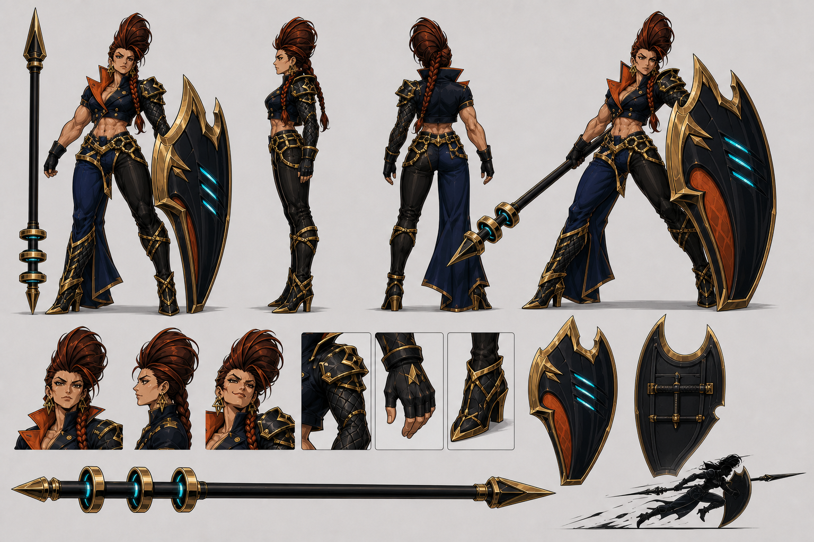

# The Rook — canonical character specification

Status: **visual canon v1**  
Selectable class name: **THE ROOK**  
Visual archetype / production codename: **THE RUNWAY DRAGOON**  
Pronouns: **she / her**



This document and the master sheet are the source of truth for all future
portraits, sprites, animation, marketing art and AI-generated references. If an
older Velocity concept disagrees with them, follow this package.

## One-sentence identity

The Rook is a powerfully built shield-lancer who carries an entire frontline on
one arm: slow, glamorous and immovable until she commits her stored momentum to
one catastrophic straight-line charge.

She is **not** a medieval knight, military tank, nimble fencer, pin-up model or
anonymous armored soldier. Her appeal comes from the contradiction between
runway-level theatrical style and siege-engine physical force.

## Design pillars

1. **The frontline is a woman.** Her physique and stance must sell the weight of
   the equipment before effects or dialogue do.
2. **Runway dragoon.** High-fashion asymmetry, impossible hair and theatrical
   posing keep her inside the game's flamboyant anime language.
3. **Vertical wall, horizontal verdict.** The shield creates a huge dark upright
   mass; the lance creates the longest clean line in the roster.
4. **Slow is stored force.** Walking looks heavy and deliberate. The dash looks
   like all that denied motion arriving at once.

## Physical design

- Adult woman, visually late twenties to mid-thirties.
- Tall, approximately 7.5 heads, with heroic rather than naturalistic
  proportions.
- Broad shoulders, visibly muscular upper arms and back, strong abdominal core,
  sturdy waist, powerful glutes, thick athletic thighs and developed calves.
- Built like a heavyweight athlete or powerlifter, not a dehydrated bodybuilder.
- Warm medium skin. Muscle planes use clean graphic shadows, not veins or
  photorealistic striation.
- Sharp cheekbones, strong jaw, straight nose, heavy dark eyebrows and narrow
  amber-brown eyes.
- Default expression is cool appraisal with her chin slightly raised. Secondary
  expression is a small challenging smirk.
- She should remain stylish and feminine without shrinking her shoulders,
  waist, arms or legs.

### Hair — strict identity rule

- Dark auburn hair with copper highlights.
- The front and crown sweep upward into one enormous sculptural vertical crest,
  like a wind-caught flame or piece of runway headwear.
- One thick long braid falls over **her left shoulder** and reaches the upper
  abdomen.
- The sides are tightly controlled so the crest stays graphic rather than
  becoming loose, fluffy hair.

The crest is not a mohawk, helmet plume, ordinary ponytail or mass of radial
spikes. The braid and crest must appear together.

## Costume construction

### Cropped command jacket

- Fitted midnight-navy cropped jacket ending above the navel.
- High split collar in burnt orange, large enough to frame the jaw at arena and
  portrait scale.
- Restrained double-breasted antique-gold buttons.
- **Her right arm is mostly bare**, displaying the muscular shoulder and bicep,
  with a short black glove.
- **Her left arm is armored** with a near-black quilted/scale-pattern sleeve,
  angular shoulder guard, forearm protection and black glove. This is the arm
  that controls the tower shield.
- No cape, long coat, full breastplate or military insignia.

### Structured waist

- Wide navy-and-near-black belt structure supports the torso and hips.
- Antique-gold angular straps and one restrained chain cross the waist.
- The visible midriff communicates strength; the waist must remain sturdy and
  anatomically capable of transferring force from the lance.
- No corset, exposed underwear, dangling purse, excessive chains or tiny
  ornamental buckles.

### Asymmetrical lower half

- **Her left leg** wears fitted near-black armored trousers.
- **Her right leg** carries the midnight-navy open trouser-drape: a long split
  tailored panel attached at the waist that moves like one runway garment but
  never hides the boot or leg action.
- Both legs remain fully covered and combat-readable.
- Pointed black/navy armored boots use stable angular heels and sparse
  antique-gold edge construction. The heel is stylized but must still look able
  to brace a charge.

## Tower shield

The shield is not an accessory. It is half of her silhouette and the visible
source of her frontal projectile guard.

- Exactly one asymmetrical tower shield.
- Ground-to-above-shoulder height and wider than her torso.
- Near-black/midnight-navy main body with a thick antique-gold structural rim.
- One dramatic gold crescent blade forms the upper outer rim.
- One large recessed burnt-orange panel fills the lower inner face.
- Exactly **three** narrow diagonal cyan energy vents cut through the dark face.
- The back has one substantial forearm brace and one horizontal handgrip sized
  for her protected left arm.
- The inner edge includes a clean lance lane so she can align the weapon beside
  the shield without clipping through it.

It must never become a round shield, buckler, transparent energy shield, pair of
shields or generic rectangle. Its crescent-rim profile is character-exclusive.

## Impact lance

- Exactly one two-handed impact/cavalry lance at least **1.6 times her height**.
- Long, thick near-black shaft with minimal gold collars.
- Large angular antique-gold diamond spearhead at the forward end.
- Smaller gold point at the butt end.
- Exactly **three** large, evenly spaced counterweight rings surround the shaft
  near the butt. Each ring has one thin cyan inner glow.
- The rings are mechanical/magical stabilizers, not loose bracelets; they remain
  perpendicular to the shaft and never float away during normal movement.
- No banner, firearm mechanism, axe blade, sword grip or extra spearheads.

Normal art should show the scale relationship honestly. If the full lance
cannot fit in a portrait crop, show enough of the three-ring butt or spearhead
to identify it rather than silently shortening the weapon.

## Palette

| Role | Canon color | Use |
|---|---:|---|
| Midnight navy | `#101B3D` | jacket, right-leg drape, shield undertone |
| Near-black | `#111117` | left trousers, gloves, armored sleeve, lance shaft |
| Burnt orange | `#C45128` | collar and shield inset |
| Antique gold | `#C79B3B` | shield rim, lance hardware, costume structure |
| Controlled cyan | `#49DCE7` | three shield vents, three lance rings, charge VFX |
| Warm skin | `#A96F52` | face, torso and right arm |
| Dark auburn | `#6F2D21` | crest and braid |

Cyan is an energy accent, never a large costume fill. Gold is structural, not
glitter. Navy and near-black must remain visibly distinct under normal lighting.
Player-team colors belong in outlines, markers and VFX rather than replacing the
canonical orange/cyan identity.

## Silhouette and arena-scale rules

- Exclusive silhouette anchors: enormous vertical hair crest, crescent-rim
  tower shield and long lance with three counterweight rings.
- Primary body shape: broad upper torso and powerful legs, never an hourglass
  reduced to a narrow waist.
- At 720p wide-camera scale, keep her visible body approximately **50–53 logical
  pixels tall**, foot-anchored to the existing 32×48 collision body. The shield
  may extend slightly above the crest and laterally beyond collision.
- In idle, the shield supplies one large vertical mass beside the body. During
  the dash, body, shield and lance collapse into one low horizontal wedge.
- At tiny scale preserve: hair crest, orange collar, bare right arm, armored left
  arm, navy right-leg drape, three cyan shield cuts and long lance line.
- Omit jewelry, buttons, abdominal detail, chains and panel seams before
  simplifying any identity anchor.
- Use a two-pixel-equivalent dark outer keyline.

Recognition test: in solid black with the face and palette removed, either the
crest-plus-shield idle silhouette or shield-and-lance dash wedge must identify
The Rook immediately.

## Movement and pose language

The Rook performs weight. She does not hurry during ordinary locomotion and
never looks burdened by the equipment. Every slow motion says that the world is
yielding around her.

- **Idle / planning:** shield planted beside the left foot, lance held upright or
  laid across the shoulder, weight settled into one hip, chin high.
- **Walk:** wide deliberate steps with minimal bounce. The shield moves first;
  the torso and lance follow. Each footfall ends with a clean held frame.
- **Aim / charge:** left shoulder braces behind the shield while the right arm
  pivots the lance along its inner lane. The weapon direction remains honest at
  every gameplay angle.
- **Lock-in:** a fashion-pose silhouette—shield planted, torso twisted away,
  lance forming a severe diagonal and free hand briefly opening above eye level.
- **Dash:** body lowers behind the shield; left shoulder, shield center and hips
  form one driving line; lance projects beside the shield as the lethal point.
- **Wall conversion:** shield strikes and rides the wall while the boots fold
  beneath her; lance and torso redirect upward along the remaining route.
- **Hit:** equipment loses alignment for one exceptional key. She recovers by
  slamming the shield down, not by fluttering backward.
- **Defeat:** one knee behind the planted shield, lance fallen across the ground,
  crest still preserving the silhouette.
- **Victory:** rests the lance across her shoulders or leans one forearm on the
  shield, then gives the opponent a small dismissive look.

Animate the body on stepped twos at an apparent 12 fps over the deterministic
60 Hz simulation. Lance, shield and hair are separate cosmetic layers. The hair
crest and right-leg drape settle one pose late, but equipment endpoints and the
dash collision line always follow authoritative gameplay state.

## Personality and presentation

The Rook is a frontline diva: commanding, physically fearless and entirely
aware that every room becomes a stage when she enters it. She enjoys forcing an
opponent to give ground. Her confidence is playful and contemptuous rather than
cruel or militaristic.

She speaks in short declarations about space, distance, posture and commitment.
She does not apologize for being slow; she treats retreat as something other
people do.

Voice direction: resonant adult contralto, relaxed projection, crisp consonants
and a smile audible under pressure. Anger becomes louder and more direct, never
shrill or panicked.

Sample tone (directional, not mandatory final copy):

- Lock-in: “This line is mine.”
- Full charge: “Nowhere left to stand.”
- Victory: “You moved. I advanced.”

## Gameplay-to-visual translation

The underlying slow-advance and stored-dash mechanics remain intact. The human
lancer fantasy now explains them visually instead of using abstract missing
frames alone.

- Suppressed walking distance charges the three cyan lance rings in order from
  butt toward grip. The three shield vents answer at lower intensity.
- One stored cell: first ring and first vent lit.
- Two stored cells: two rings and two vents lit; hair and drape begin pulling
  subtly toward the intended route.
- Three stored cells: all rings and vents lit; a thin cyan line joins lance,
  shield and predicted endpoint.
- Dash release spends every completed cell. Each spent cell collapses one cyan
  afterimage panel behind her and lengthens the committed route.
- The shield visibly deflects frontal projectiles. The lance tip and body charge
  deliver the lethal contact.
- The full three-cell guard bonus is announced by a gold rim light closing
  around the shield crescent. Attacks from above, below or behind remain honest
  threats and receive no protective effect.
- Dash exit retains only controlled momentum: the stabilizer rings dim in
  sequence and the shield scrapes down into a braking pose.
- She has no ordinary ground jump. Upward access is presented as a committed
  wall-redirecting shield charge, not graceful aerial mobility.
- SUPER starts with all three rings igniting simultaneously before a longer,
  harder shield-first route.

VFX geometry: long parallel lines, concentric stabilizer rings, broken frame
panels and one shield-shaped wedge. Avoid lightning storms, fire trails, angelic
wings, generic speed clouds or vehicle exhaust.

Working move-language recommendations:

- Stored resource: **MOMENTUM** (three cells)
- Dash: **BREAK LINE**
- Full frontal guard: **HOLD THE LINE**
- SUPER: **NO GROUND GIVEN**

These are presentation recommendations; they do not require renaming internal
`DASHBLADE` or Lost Frame code identifiers.

## Portrait and camera rules

- HUD portrait: face, orange collar, armored left shoulder and braid visible;
  crest may breach the top crop deliberately but must not disappear.
- Character select: shield planted as the secondary mass, lance crossing behind
  her shoulders, powerful legs visible.
- SUPER cut-in: low camera, shield crescent cutting one side of frame, her face
  above it and the lance line tearing across the opposite diagonal.
- Preserve her muscular neck, shoulder and arm proportions in every close-up.
- Normal eyes remain amber-brown. Cyan eye glow is not part of the base design.

## Audio texture

- Steps: deep, tailored heel impact followed by shield-weight resonance.
- Shield: low metal body with a brief glassy cyan harmonic at each deflection.
- Lance rings: three distinct ascending tuning clicks as momentum fills.
- Charge: one compressed bass transient, armor snap and narrow cutting rush.
- Braking: hard shield scrape, three descending ring clicks and a clean stop.
- Avoid engine revs, gunfire, medieval armor rattling or constant electrical hum.

## Hard anti-drift rules

Reject an image or animation if any of the following is true:

- she becomes slender, dainty, teenage, bodybuilder-veiny or pin-up posed;
- the vertical crest or thick left-shoulder braid is missing or becomes ordinary
  loose hair;
- the armored sleeve moves off her left arm, the bare muscular arm moves off her
  right, or the navy drape moves off her right leg;
- the shield is smaller than her torso, round, rectangular, duplicated or loses
  its crescent rim, orange inset or exactly three cyan vents;
- the lance is an ordinary spear, cropped short, used one-handed without
  bracing, or loses its exactly three cyan counterweight rings;
- full medieval plate, a cape, skirt, helmet, firearm, sword or second weapon is
  added;
- her sturdy waist is cinched into an impossible corset;
- cyan or gold expands into a dominant costume fill;
- chessboards, rook icons, crowns or literal castle battlements are added. The
  name describes her battlefield role; it is not a costume theme;
- rendering loses the theatrical high-fashion anime/manga character of the game
  in favor of photorealism, generic Western fantasy or military sci-fi.

## Reusable AI prompt — full character

```text
One original female anime fighting-game character named THE ROOK, visual
archetype “Runway Dragoon”: tall powerful adult woman with broad shoulders,
muscular arms and back, strong sturdy waist, defined core, large athletic thighs
and calves, warm medium skin, sharp cheekbones, heavy dark brows and narrow
amber-brown eyes. Dark auburn hair forms one enormous sculptural vertical swept
crest; one thick long braid falls over her left shoulder. Cropped fitted
midnight-navy military-fashion jacket, large burnt-orange split collar,
restrained antique-gold buttons; muscular right arm mostly bare with short black
glove; left arm covered by a near-black quilted armored sleeve, angular shoulder
guard and black glove. Broad structured navy-and-gold waist belt; fitted
near-black trousers on her left leg; long open midnight-navy tailored drape on
her right leg; pointed black/navy armored boots with stable angular heels and
sparse gold edges.

She carries exactly one enormous asymmetrical tower shield on her left arm,
taller and wider than her torso: near-black/navy body, bold antique-gold crescent
upper rim, one burnt-orange inset and exactly three diagonal cyan vents. She
carries exactly one massive two-handed impact lance at least 1.6 times her
height: thick near-black shaft, large angular gold diamond spearhead, small gold
butt point and exactly three large cyan-lit stabilizer rings near the butt.
Theatrical, confrontational, glamorous and physically imposing; wide planted
stance, chin high, shield as a vertical wall and lance as one severe line. Crisp
original high-fashion anime/manga game concept art, clean near-black contour,
hard cel shading, bold graphic shadows. Palette: midnight navy #101B3D,
near-black #111117, burnt orange #C45128, antique gold #C79B3B, controlled cyan
#49DCE7, warm skin #A96F52, dark auburn hair #6F2D21. No text or watermark.

AVOID: resemblance to existing characters, slender model anatomy, tiny waist,
dainty limbs, bikini armor, pin-up pose, ordinary spear, small or round shield,
generic medieval knight, full plate, cape, helmet, sword, gun, extra weapons,
extra shield, missing hair crest or braid, reversed costume asymmetry, wrong
ring/vent count, chess symbols, photorealism, 3D rendering.
```

For new generations, append only the requested pose, framing, expression and
background. Do not rewrite the identity block from memory.

## Per-asset requirements

| Asset | Must show | May simplify |
|---|---|---|
| Arena sprite | crest, broad body, orange collar, shield crescent, lance line, three ring/vent charge states | face, chains, buttons, abdominal detail |
| Planning ghost | exact live silhouette, shield/lance route and lit-cell count | all costume texture and facial features |
| HUD portrait | same face, crest base, braid, orange collar, armored left shoulder | shield body and lower costume |
| SUPER cut-in | muscular face/shoulders, shield crescent, lance diagonal, three lit rings | legs and shield back construction |
| Character select | full body, huge shield, complete lance relationship | tiny gold harness geometry |
| Marketing key art | every canonical asymmetry, weapon ratio and palette role | nothing identity-bearing |

## Approval checklist

Before accepting a Rook asset, answer yes to all of these:

1. Is the selectable class named **The Rook**?
2. Does she read as a tall heavyweight athlete rather than a slender model?
3. Are the vertical auburn crest and thick left-shoulder braid both present?
4. Is her left arm armored and shield-bearing while her right arm is bare?
5. Is the navy drape on her right leg and the fitted black trouser on her left?
6. Is the shield larger than her torso with one crescent rim, one orange inset
   and exactly three cyan vents?
7. Is the lance at least 1.6 times her height with exactly three cyan-lit rings?
8. Does the pose communicate weight, confrontation and theatrical confidence?
9. Are the shield guard and lance attack direction mechanically honest?
10. Does the result remain original, flamboyant anime/manga game art rather
    than generic medieval or military design?

## Canonical and supporting files

- Master sheet: `docs/concepts/velocity-rework/rook-master-sheet-v1.png`
- Runtime portrait: `assets/art/portraits/rook-portrait-v1.png`
- Approved direction mockup: `docs/concepts/velocity-rework/velocity-heavy-shield-lancer-mockup-v1.png`
- Retained alternate idea, **not Rook canon**: `docs/concepts/velocity-rework/velocity-imprisoned-angel-mockup-v1.png`
- Mechanics reference: `docs/VELOCITY_LOST_FRAMES_PROTOTYPE_2026-08-20.md`

Superseded for visual identity: all earlier `velocity-*-portrait-v1.png` concept
variants and `dashblade-portrait-v1.png`. They remain as historical exploration
only and must not guide future Rook art or return to runtime wiring.
